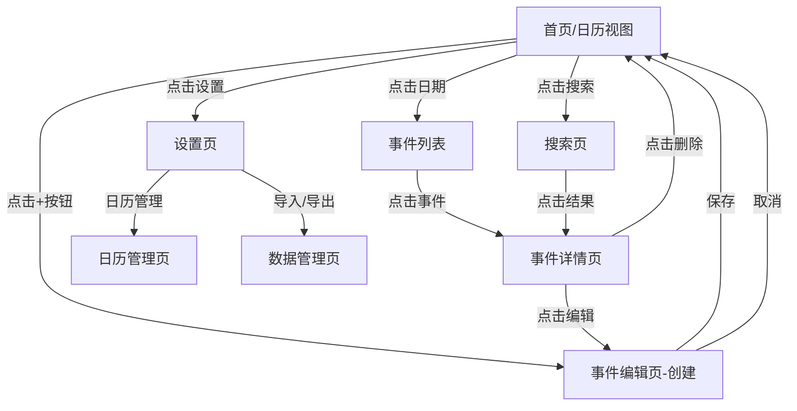
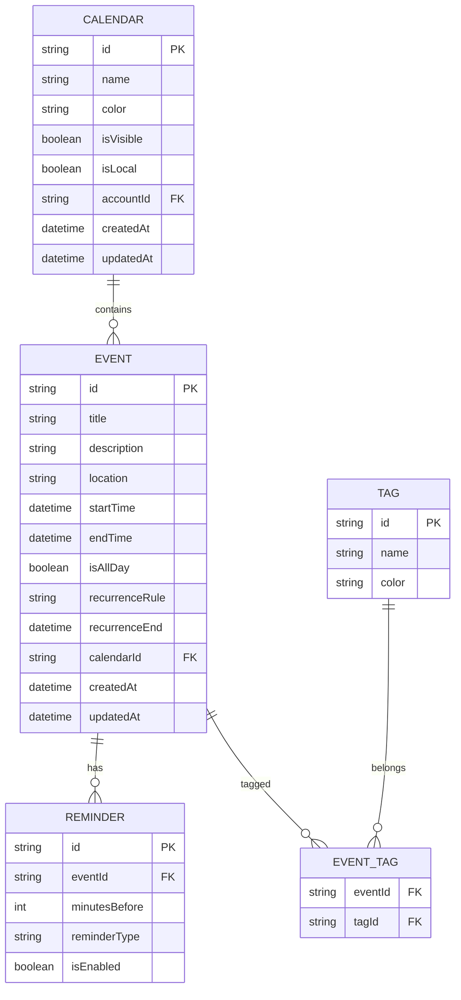

# 安卓日历App产品需求文档 (PRD)

## 1. 产品概述

### 1.1 产品定位
一款简洁高效的安卓原生日历应用，专注于帮助用户高效管理时间和日程安排，提供多维度视图切换和智能提醒功能。

### 1.2 目标用户
- 职场人士：需要管理工作会议、项目截止日期
- 学生群体：管理课程表、考试日期、作业截止
- 家庭用户：记录家庭活动、纪念日、生日提醒

### 1.3 核心价值主张
- **多视图切换**：支持月/周/日/年四种视图，满足不同场景需求
- **智能提醒**：灵活的提醒设置，确保重要事项不遗漏
- **个性化定制**：主题切换、日历分类、标签管理
- **数据安全**：本地存储与云端备份，数据永不丢失

---

## 2. 功能需求

### 2.1 用户角色

| 角色 | 注册方式 | 核心权限 |
|------|----------|----------|
| 普通用户 | 无需注册，本地使用 | 基础日历功能、本地数据存储 |
| 高级用户 | 邮箱/Google账号登录 | 云同步、跨设备访问、高级主题 |

### 2.2 功能模块

本日历App包含以下核心页面：

1. **首页（日历视图）**：月视图/周视图/日视图/年视图切换、事件展示、快速导航
2. **事件详情页**：事件信息展示、编辑入口、删除操作
3. **事件编辑页**：创建/编辑事件、设置提醒、选择日历分类
4. **搜索页**：关键词搜索、筛选条件、搜索结果列表
5. **设置页**：主题切换、提醒设置、导入导出、账户管理
6. **小组件**：桌面快捷查看、快速添加事件

### 2.3 页面详情

| 页面名称 | 模块名称 | 功能描述 |
|----------|----------|----------|
| 首页 | 视图切换栏 | 支持月视图、周视图、日视图、年视图四种模式切换 |
| 首页 | 日历展示区 | 根据当前视图模式渲染日历网格，展示事件标记 |
| 首页 | 事件列表区 | 展示选中日期的事件列表，支持点击查看详情 |
| 首页 | 快速添加按钮 | 悬浮按钮，点击快速创建新事件 |
| 首页 | 日期导航 | 左右滑动切换日期，点击标题快速跳转指定日期 |
| 事件详情页 | 事件信息展示 | 展示事件标题、时间、地点、描述、提醒设置等完整信息 |
| 事件详情页 | 操作按钮 | 提供编辑、删除、分享事件功能 |
| 事件编辑页 | 基础信息表单 | 输入事件标题、选择开始/结束时间、设置地点 |
| 事件编辑页 | 提醒设置 | 选择提醒时间（开始前5/15/30分钟、1小时、1天或自定义） |
| 事件编辑页 | 重复设置 | 设置事件重复规则（每天、每周、每月、每年、自定义） |
| 事件编辑页 | 日历分类 | 选择事件所属日历（工作、个人、家庭等） |
| 事件编辑页 | 标签管理 | 添加/选择标签，支持多标签 |
| 搜索页 | 搜索输入框 | 输入关键词搜索事件标题、地点、描述 |
| 搜索页 | 筛选条件 | 按日期范围、日历分类、标签筛选 |
| 搜索页 | 结果列表 | 展示搜索结果，支持点击进入详情 |
| 设置页 | 外观设置 | 切换深色/浅色模式，选择主题色 |
| 设置页 | 提醒设置 | 设置默认提醒时间、提醒铃声、震动开关 |
| 设置页 | 日历管理 | 创建/编辑/删除日历分类，设置颜色 |
| 设置页 | 数据管理 | 导入/导出日历数据（ICS格式），云同步开关 |
| 设置页 | 账户管理 | 登录/登出、账户信息查看 |
| 小组件 | 月视图小组件 | 桌面展示月历，标记有事件的日期 |
| 小组件 | 事件列表小组件 | 展示今日/近日事件列表 |
| 小组件 | 快速添加小组件 | 一键打开事件创建页面 |

---

## 3. 核心流程

### 3.1 用户操作流程

**创建事件流程：**
1. 用户打开App进入首页，选择目标日期
2. 点击悬浮"+"按钮或点击日期进入事件编辑页
3. 填写事件标题、选择时间、设置提醒
4. 选择日历分类和标签（可选）
5. 点击保存，事件创建成功，返回首页

**查看事件流程：**
1. 用户在首页切换视图模式（月/周/日/年）
2. 浏览日历，点击有标记的日期
3. 查看事件列表，点击具体事件
4. 进入事件详情页查看完整信息

**搜索事件流程：**
1. 用户点击首页搜索图标进入搜索页
2. 输入关键词或选择筛选条件
3. 查看搜索结果列表
4. 点击结果进入事件详情

### 3.2 页面导航流程图



---

## 4. 用户界面设计

### 4.1 设计原则
- **简洁清晰**：界面布局简洁，信息层级清晰
- **一致性**：遵循Material Design 3设计规范
- **可访问性**：支持屏幕阅读器、字体大小调节
- **响应式**：适配不同屏幕尺寸和分辨率

### 4.2 配色方案

| 场景 | 浅色模式 | 深色模式 |
|------|----------|----------|
| 主色调 | #6750A4 (紫色) | #D0BCFF (浅紫) |
| 次色调 | #625B71 (灰紫) | #CCC2DC (浅灰紫) |
| 背景色 | #FFFBFE (米白) | #1C1B1F (深灰) |
| 表面色 | #F7F2FA (浅灰) | #2B2930 (中灰) |
| 文字主色 | #1C1B1F (黑) | #E6E1E5 (白) |
| 文字次色 | #49454F (深灰) | #CAC4D0 (浅灰) |
| 错误色 | #B3261E (红) | #F2B8B5 (浅红) |

### 4.3 字体规范

| 元素 | 字体 | 字号 | 字重 |
|------|------|------|------|
| 页面标题 | Roboto | 22sp | Medium |
| 日期数字 | Roboto | 16sp | Regular |
| 事件标题 | Roboto | 14sp | Medium |
| 正文内容 | Roboto | 14sp | Regular |
| 辅助文字 | Roboto | 12sp | Regular |

### 4.4 组件规范

**按钮样式：**
- 悬浮操作按钮：圆形，直径56dp，主色调背景
- 文字按钮：圆角8dp，主色调文字
- 填充按钮：圆角12dp，主色调背景，白色文字

**卡片样式：**
- 事件卡片：圆角12dp，表面色背景，阴影2dp
- 日历单元格：无圆角，选中状态显示主色调边框

**输入框样式：**
- 圆角8dp，表面色背景
- 聚焦时显示主色调边框

### 4.5 页面设计概述

| 页面名称 | 模块名称 | UI元素说明 |
|----------|----------|------------|
| 首页 | 顶部栏 | 显示当前年月，左右箭头切换月份，搜索和设置图标 |
| 首页 | 视图切换 | Tab栏：月/周/日/年，主色调指示器 |
| 首页 | 日历网格 | 7列网格，星期标题行，日期单元格显示事件点标记 |
| 首页 | 事件列表 | 底部抽屉式列表，展示选中日期的事件 |
| 首页 | FAB按钮 | 右下角圆形悬浮按钮，+图标，主色调 |
| 事件编辑页 | 表单区域 | 标题输入框、日期时间选择器、地点输入 |
| 事件编辑页 | 设置区域 | 提醒选择器、重复规则选择器、日历选择器 |
| 事件编辑页 | 操作栏 | 保存/取消按钮 |
| 设置页 | 分组列表 | 外观、提醒、数据、账户分组，带图标和箭头 |

### 4.6 响应式设计

- **手机端**：纵向布局，日历网格适配屏幕宽度
- **平板端**：双栏布局，左侧日历右侧事件列表
- **小组件**：支持2x2、4x2、4x3等多种尺寸

---

## 5. 数据模型

### 5.1 实体关系图



### 5.2 数据定义

**日历表 (calendars)**
```sql
CREATE TABLE calendars (
    id TEXT PRIMARY KEY,
    name TEXT NOT NULL,
    color TEXT NOT NULL DEFAULT '#6750A4',
    is_visible INTEGER DEFAULT 1,
    is_local INTEGER DEFAULT 1,
    account_id TEXT,
    created_at INTEGER NOT NULL,
    updated_at INTEGER NOT NULL
);
```

**事件表 (events)**
```sql
CREATE TABLE events (
    id TEXT PRIMARY KEY,
    title TEXT NOT NULL,
    description TEXT,
    location TEXT,
    start_time INTEGER NOT NULL,
    end_time INTEGER NOT NULL,
    is_all_day INTEGER DEFAULT 0,
    recurrence_rule TEXT,
    recurrence_end INTEGER,
    calendar_id TEXT NOT NULL,
    created_at INTEGER NOT NULL,
    updated_at INTEGER NOT NULL,
    FOREIGN KEY (calendar_id) REFERENCES calendars(id)
);
```

**提醒表 (reminders)**
```sql
CREATE TABLE reminders (
    id TEXT PRIMARY KEY,
    event_id TEXT NOT NULL,
    minutes_before INTEGER DEFAULT 15,
    reminder_type TEXT DEFAULT 'notification',
    is_enabled INTEGER DEFAULT 1,
    FOREIGN KEY (event_id) REFERENCES events(id) ON DELETE CASCADE
);
```

**标签表 (tags)**
```sql
CREATE TABLE tags (
    id TEXT PRIMARY KEY,
    name TEXT NOT NULL UNIQUE,
    color TEXT DEFAULT '#6750A4'
);
```

**事件标签关联表 (event_tags)**
```sql
CREATE TABLE event_tags (
    event_id TEXT NOT NULL,
    tag_id TEXT NOT NULL,
    PRIMARY KEY (event_id, tag_id),
    FOREIGN KEY (event_id) REFERENCES events(id) ON DELETE CASCADE,
    FOREIGN KEY (tag_id) REFERENCES tags(id) ON DELETE CASCADE
);
```

---

## 6. 非功能需求

### 6.1 性能要求
- 应用启动时间 < 2秒
- 日历视图切换 < 300ms
- 事件列表加载 < 500ms
- 支持单日历10000+事件流畅运行

### 6.2 安全性
- 本地数据使用SQLCipher加密存储
- 云同步使用HTTPS传输
- 用户隐私数据不上传服务器（可选同步除外）

### 6.3 兼容性
- 最低支持Android 8.0 (API 26)
- 适配Android 8.0 - 14.0
- 支持主流屏幕分辨率（320dp - 600dp+）

### 6.4 可靠性
- 数据自动本地备份
- 崩溃恢复机制
- 提醒服务保活机制

---

## 7. 技术架构建议

- **开发语言**：Kotlin
- **架构模式**：MVVM + Repository模式
- **UI框架**：Jetpack Compose
- **本地存储**：Room数据库
- **依赖注入**：Hilt
- **异步处理**：Kotlin Coroutines + Flow
- **后台任务**：WorkManager
- **通知**：NotificationManager + AlarmManager

---

*文档版本：v1.0*  
*创建日期：2026-04-13*  
*最后更新：2026-04-13*
