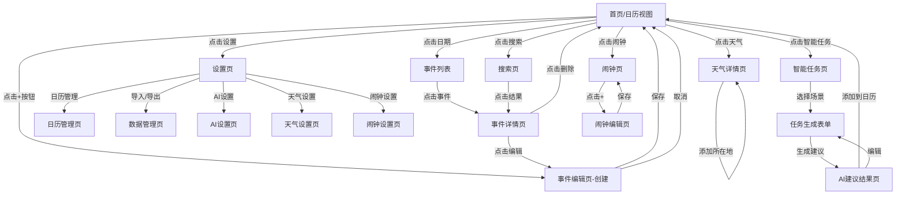
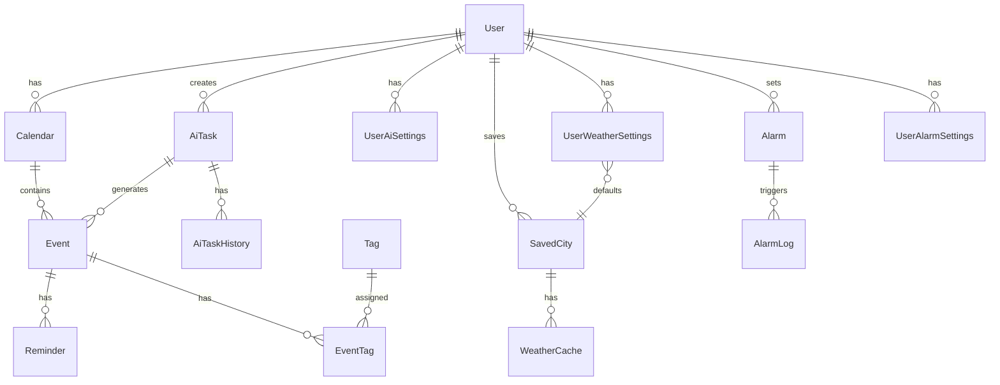

# 安卓日历App产品需求文档 (PRD)

## 版本历史

| 版本   | 日期         | 更新内容                        | 作者 |
| ---- | ---------- | --------------------------- | -- |
| v1.0 | 2026-04-13 | 初始版本，基础日历功能                 | -  |
| v2.0 | 2026-04-14 | 新增智能任务处理模块，支持AI任务建议和场景化任务管理 | -  |
| v3.0 | 2026-04-15 | 新增天气和闹钟功能，天气功能支持添加所在地天气     | -  |

***

## 1. 产品概述

### 1.1 产品定位

一款简洁高效的安卓原生日历应用，专注于帮助用户高效管理时间和日程安排。v3.0版本新增天气和闹钟功能，为用户提供一站式的日程管理体验。

### 1.2 目标用户

- **职场人士**：需要管理工作会议、项目截止日期、团建活动
- **学生群体**：管理课程表、考试日期、作业截止、旅行计划
- **家庭用户**：记录家庭活动、纪念日、生日提醒、聚餐安排
- **旅行爱好者**：规划旅行行程、获取目的地建议、查看目的地天气

### 1.3 核心价值主张

- **多视图切换**：支持月/周/日/年四种视图，满足不同场景需求
- **智能提醒**：灵活的提醒设置，确保重要事项不遗漏
- **AI任务建议**：基于大模型的智能任务规划和建议
- **场景化任务**：旅游、团建、聚餐等场景一键创建
- **天气功能**：日历上显示天气信息，支持多城市管理
- **闹钟功能**：灵活的闹钟设置，支持贪睡和统计
- **个性化定制**：主题切换、日历分类、标签管理
- **数据安全**：本地存储与云端备份，数据永不丢失

***

## 2. 功能需求

### 2.1 用户角色

| 角色   | 注册方式          | 核心权限                  |
| ---- | ------------- | --------------------- |
| 普通用户 | 无需注册，本地使用     | 基础日历功能、本地数据存储、基础任务管理  |
| 高级用户 | 邮箱/Google账号登录 | 云同步、跨设备访问、高级主题、AI任务建议 |

### 2.2 功能模块

本日历App包含以下核心页面：

1. **<mark style="background-color: #fff3cd;">首页（日历视图）</mark>**：<mark style="background-color: #fff3cd;">月视图/周视图/日视图/年视图切换、事件展示、快速导航</mark>、天气显示
2. **事件详情页**：事件信息展示、编辑入口、删除操作
3. **<mark style="background-color: #fff3cd;">事件编辑页</mark>**：<mark style="background-color: #fff3cd;">创建/编辑事件、设置提醒、选择日历分类</mark>
4. **智能任务页**：AI任务建议、场景化任务模板、任务生成
5. **天气详情页**：当前天气、7天预报、24小时预报、多城市管理
6. **闹钟页**：闹钟列表、创建/编辑闹钟、闹钟统计
7. **<mark style="background-color: #fff3cd;">搜索页</mark>**：<mark style="background-color: #fff3cd;">关键词搜索、筛选条件、搜索结果列表</mark>
8. **<mark style="background-color: #fff3cd;">设置页</mark>**：<mark style="background-color: #fff3cd;">主题切换、提醒设置</mark>、导入导出、账户管理、AI设置、天气设置、闹钟设置
9. **小组件**：桌面快捷查看、快速添加事件

### 2.3 页面详情

#### 2.3.1 原有页面功能

| 页面名称  | 模块名称                                                   | 功能描述                                                                            |
| ----- | ------------------------------------------------------ | ------------------------------------------------------------------------------- |
| 首页    | <mark style="background-color: #fff3cd;">视图切换栏</mark>  | <mark style="background-color: #fff3cd;">支持月视图、周视图、日视图、年视图四种模式切换</mark>         |
| 首页    | <mark style="background-color: #fff3cd;">日历展示区</mark>  | <mark style="background-color: #fff3cd;">根据当前视图模式渲染日历网格，展示事件标记</mark>、天气图标      |
| 首页    | <mark style="background-color: #fff3cd;">事件列表区</mark>  | <mark style="background-color: #fff3cd;">展示选中日期的事件列表，支持点击查看详情</mark>            |
| 首页    | <mark style="background-color: #fff3cd;">快速添加按钮</mark> | <mark style="background-color: #fff3cd;">悬浮按钮，点击快速创建新事件</mark>                  |
| 首页    | <mark style="background-color: #fff3cd;">日期导航</mark>   | <mark style="background-color: #fff3cd;">左右滑动切换日期，点击标题快速跳转指定日期</mark>           |
| 事件详情页 | 事件信息展示                                                 | 展示事件标题、时间、地点、描述、提醒设置等完整信息                                                       |
| 事件详情页 | 操作按钮                                                   | 提供编辑、删除、分享事件功能                                                                  |
| 事件编辑页 | <mark style="background-color: #fff3cd;">基础信息表单</mark> | <mark style="background-color: #fff3cd;">输入事件标题、选择开始/结束时间、设置地点</mark>           |
| 事件编辑页 | <mark style="background-color: #fff3cd;">提醒设置</mark>   | <mark style="background-color: #fff3cd;">选择提醒时间（开始前5/15/30分钟、1小时、1天或自定义）</mark> |
| 事件编辑页 | <mark style="background-color: #fff3cd;">重复设置</mark>   | <mark style="background-color: #fff3cd;">设置事件重复规则（每天、每周、每月、每年、自定义）</mark>       |
| 事件编辑页 | <mark style="background-color: #fff3cd;">日历分类</mark>   | <mark style="background-color: #fff3cd;">选择事件所属日历（工作、个人、家庭等）</mark>             |
| 事件编辑页 | <mark style="background-color: #fff3cd;">标签管理</mark>   | <mark style="background-color: #fff3cd;">添加/选择标签，支持多标签</mark>                   |
| 搜索页   | <mark style="background-color: #fff3cd;">搜索输入框</mark>  | <mark style="background-color: #fff3cd;">输入关键词搜索事件标题、地点、描述</mark>               |
| 搜索页   | <mark style="background-color: #fff3cd;">筛选条件</mark>   | <mark style="background-color: #fff3cd;">按日期范围、日历分类、标签筛选</mark>                 |
| 搜索页   | <mark style="background-color: #fff3cd;">结果列表</mark>   | <mark style="background-color: #fff3cd;">展示搜索结果，支持点击进入详情</mark>                 |
| 小组件   | 月视图小组件                                                 | 桌面展示月历，标记有事件的日期                                                                 |
| 小组件   | 事件列表小组件                                                | 展示今日/近日事件列表                                                                     |
| 小组件   | 快速添加小组件                                                | 一键打开事件创建页面                                                                      |

#### 2.3.2 新增：智能任务页（AI Task Assistant）

| 页面名称  | 模块名称   | 功能描述                                  |
| ----- | ------ | ------------------------------------- |
| 智能任务页 | 场景选择区  | 展示任务场景卡片：旅游行程、团队建设、聚餐约会、会议安排、自定义任务    |
| 智能任务页 | 旅游行程模块 | 输入目的地、出行时间、出行类型（自由行/跟团/商务），AI生成完整行程建议 |
| 智能任务页 | 团建任务模块 | 输入团队规模、预算范围、活动偏好，AI推荐团建方案和场地          |
| 智能任务页 | 聚餐任务模块 | 输入人数、预算、口味偏好、地理位置，AI推荐餐厅和预订建议         |
| 智能任务页 | 会议安排模块 | 输入会议主题、参会人数、时长需求，AI推荐会议时段和会议室         |
| 智能任务页 | 任务预览区  | 展示AI生成的任务列表，支持编辑、删除、添加到日历             |
| 智能任务页 | 历史任务区  | 展示用户创建过的智能任务历史记录                      |

#### 2.3.3 新增：天气详情页

| 页面名称  | 模块名称    | 功能描述                             |
| ----- | ------- | -------------------------------- |
| 天气详情页 | 当前天气展示  | 显示当前温度、天气图标、体感温度、湿度、风速、风向、气压、能见度 |
| 天气详情页 | 7天天气预报  | 展示未来7天的天气、最高/最低温度、降水概率           |
| 天气详情页 | 24小时预报  | 展示未来24小时的逐小时天气、温度、降水概率           |
| 天气详情页 | 空气质量    | 显示AQI指数、空气质量等级、首要污染物             |
| 天气详情页 | 生活指数    | 显示穿衣指数、运动指数、紫外线指数、洗车指数、感冒指数、旅游指数 |
| 天气详情页 | 城市选择    | 下拉选择已保存的城市，支持添加新城市               |
| 天气详情页 | 添加所在地天气 | 一键获取当前位置并添加到城市列表（GPS定位）          |
| 天气详情页 | 城市管理    | 添加城市、删除城市、设置默认城市                 |
| 天气详情页 | 刷新按钮    | 手动刷新天气数据                         |

#### 2.3.4 新增：闹钟页

| 页面名称  | 模块名称   | 功能描述                               |
| ----- | ------ | ---------------------------------- |
| 闹钟页   | 闹钟列表   | 展示所有闹钟，显示时间、重复规则、标签、开关状态           |
| 闹钟页   | 快速开关   | 点击闹钟列表右侧开关快速启用/禁用闹钟                |
| 闹钟页   | 添加闹钟按钮 | 悬浮按钮，打开闹钟编辑页面                      |
| 闹钟页   | 闹钟统计   | 查看响铃次数、贪睡次数、平均起床时间                 |
| 闹钟编辑页 | 时间选择   | 选择闹钟的小时和分钟                         |
| 闹钟编辑页 | 重复设置   | 单次/每天/工作日/周末/自定义星期                 |
| 闹钟编辑页 | 标签输入   | 输入闹钟标签（如：起床、上班、运动等）                |
| 闹钟编辑页 | 铃声选择   | 选择系统铃声或本地音乐                        |
| 闹钟编辑页 | 震动开关   | 启用/禁用震动                            |
| 闹钟编辑页 | 贪睡设置   | 贪睡间隔（5/10/15/30分钟）、贪睡次数（1/3/5/无限次） |
| 闹钟编辑页 | 高级设置   | 渐强音量、静音模式下响铃、最大响铃时长                |

#### 2.3.5 新增：设置页（更新）

| 页面名称 | 模块名称 | 功能描述                       |
| ---- | ---- | -------------------------- |
| 设置页  | 外观设置 | 切换深色/浅色模式，选择主题色            |
| 设置页  | 提醒设置 | 设置默认提醒时间、提醒铃声、震动开关         |
| 设置页  | 日历管理 | 创建/编辑/删除日历分类，设置颜色          |
| 设置页  | 数据管理 | 导入/导出日历数据（ICS格式），云同步开关     |
| 设置页  | 账户管理 | 登录/登出、账户信息查看               |
| 设置页  | AI设置 | API密钥配置、模型选择、隐私设置          |
| 设置页  | 天气设置 | 温度单位（℃/℉）、自动更新频率、显示设置、默认城市 |
| 设置页  | 闹钟设置 | 默认铃声、默认震动、默认贪睡设置           |

***

## 3. 新增：天气功能详细设计

### 3.1 天气功能概述

天气功能为用户提供日历上的天气信息展示、详细天气查询、多城市管理等功能。支持GPS定位获取当前位置天气，并提供"添加所在地天气"一键功能。

### 3.2 天气数据展示

#### 3.2.1 日历视图天气显示

**月视图：**

- 在日期格子右上角显示天气图标
- 显示当日最高/最低温度
- 超出API数据范围的日期不显示天气

**周视图/日视图：**

- 顶部显示当前天气（温度、图标）
- 每个时间段显示对应天气

#### 3.2.2 天气详情页布局

```
┌─────────────────────────────┐
│  天气详情       [城市▼] [刷新] │
├─────────────────────────────┤
│                             │
│     🌤️                    │  ← 天气图标
│    26°                     │  ← 当前温度
│    晴  体感 28°            │  ← 天气描述、体感温度
│                             │
│  📍 北京市                  │  ← 城市名称
│  🕐 最后更新：14:30        │  ← 更新时间
│                             │
├─────────────────────────────┤
│  💧 湿度 45%    🌬️ 风 3级 │  ← 详细指标
│  📊 气压 1013hPa  👁️ 能见度10km │
│  🌡️ 紫外线 中等            │
├─────────────────────────────┤
│  📅 7天预报                │
│  ┌─────────────────────┐   │
│  │ 今天  🌤️  26°/18°   │   │
│  │ 明天  🌦️  24°/17°   │   │
│  │ ...                 │   │
│  └─────────────────────┘   │
├─────────────────────────────┤
│  ⏰ 24小时预报              │
│  ┌─────────────────────┐   │
│  │ 14:00  🌤️  26°     │   │
│  │ 15:00  🌤️  27°     │   │
│  │ ...                 │   │
│  └─────────────────────┘   │
├─────────────────────────────┤
│  🎯 生活指数                │
│  [👔 穿衣：舒适] [🏃 运动：适宜] │
│  [🧴 紫外线：中等] [🚗 洗车：适宜] │
├─────────────────────────────┤
│  ┌─────────────────────┐   │
│  │  📍 添加所在地天气    │   │  ← 新增功能按钮
│  └─────────────────────┘   │
│  ┌─────────────────────┐   │
│  │  ➕ 添加城市         │   │
│  └─────────────────────┘   │
└─────────────────────────────┘
```

### 3.3 天气数据来源

#### 3.3.1 天气API选择

| API提供商         | 优点          | 缺点        | 推荐度   |
| -------------- | ----------- | --------- | ----- |
| OpenWeatherMap | 免费额度充足、数据准确 | 部分城市数据不全  | ⭐⭐⭐⭐  |
| 和风天气           | 国内数据准确、中文友好 | 免费额度有限    | ⭐⭐⭐⭐⭐ |
| AccuWeather    | 数据最准确       | 免费额度少、成本高 | ⭐⭐⭐   |

**推荐：和风天气（国内）+ OpenWeatherMap（海外）**

#### 3.3.2 天气数据缓存策略

- **缓存时间**：当前天气缓存30分钟，7天预报缓存2小时
- **本地存储**：使用Room数据库存储天气数据
- **过期清理**：自动删除7天前的缓存数据
- **离线模式**：无网络时显示最后一次缓存数据

### 3.4 位置获取

#### 3.4.1 定位方式

| 定位方式  | 精度 | 说明          |
| ----- | -- | ----------- |
| GPS定位 | 高  | 优先使用，需要位置权限 |
| 网络定位  | 中  | GPS不可用时使用   |
| IP定位  | 低  | 快速获取大致位置    |
| 手动选择  | -  | 用户自主选择城市    |

#### 3.4.2 "添加所在地天气"功能流程

```
用户点击"添加所在地天气"按钮
    ↓
检查位置权限
    ↓
未授权 → 请求位置权限 → 用户拒绝 → 提示"需要位置权限"
    ↓ 用户授权
获取当前经纬度
    ↓
根据经纬度查询城市名称
    ↓
检查城市是否已保存
    ↓
已保存 → 提示"该城市已添加"
    ↓ 未保存
保存城市到SavedCity表
    ↓
设置为默认城市（可选）
    ↓
获取该城市天气并显示
    ↓
提示"所在地天气已添加"
```

### 3.5 多城市管理

#### 3.5.1 城市列表

- 支持保存最多10个城市
- 每个城市显示当前天气和温度
- 长按可删除城市
- 点击切换默认城市

#### 3.5.2 城市搜索

- 支持拼音、中文、英文搜索
- 显示搜索历史
- 热门城市推荐

***

## 4. 新增：闹钟功能详细设计

### 4.1 闹钟功能概述

闹钟功能提供灵活的闹钟管理，支持多种重复规则、贪睡功能、统计分析等。

### 4.2 闹钟核心功能

#### 4.2.1 闹钟创建流程

```
用户点击添加闹钟按钮
    ↓
进入闹钟编辑页
    ↓
选择时间（小时+分钟）
    ↓
设置重复规则（单次/每天/工作日/周末/自定义）
    ↓
输入标签（可选）
    ↓
选择铃声（可选）
    ↓
设置震动（可选）
    ↓
设置贪睡（可选）
    ↓
高级设置（可选）
    ↓
保存闹钟
    ↓
注册到系统AlarmManager
    ↓
返回闹钟列表
```

#### 4.2.2 闹钟响铃界面

```
┌─────────────────────────────┐
│                             │
│                             │
│         07:30              │  ← 大字体时间
│                             │
│       起床上班              │  ← 闹钟标签
│                             │
│                             │
│  ┌────────────┐ ┌──────────┐ │
│  │   贪睡10分钟  │ │   停止   │ │  ← 操作按钮
│  └────────────┘ └──────────┘ │
│                             │
└─────────────────────────────┘
```

### 4.3 闹钟高级功能

#### 4.3.1 贪睡功能

- **贪睡间隔**：5/10/15/30分钟可选择
- **贪睡次数**：1/3/5/无限次可选择
- **智能贪睡**：根据日程自动调整
- **强制停止**：通过数学题/拍照等方式停止

#### 4.3.2 闹钟统计

- **响铃次数**：统计总响铃次数
- **贪睡次数**：统计总贪睡次数
- **平均起床时间**：计算平均起床时间
- **起床趋势**：按周/月展示起床时间变化

#### 4.3.3 智能闹钟

- **天气闹钟**：根据天气调整起床时间
- **节假日闹钟**：自动跳过节假日
- **工作日闹钟**：自动识别工作日
- **假期闹钟**：根据日历事件自动调整

### 4.4 闹钟设置

#### 4.4.1 全局设置

- **默认铃声**：设置默认闹钟铃声
- **默认震动**：设置是否默认开启震动
- **默认贪睡间隔**：设置默认贪睡间隔
- **默认贪睡次数**：设置默认贪睡次数
- **渐强音量**：铃声逐渐增大
- **静音模式下响铃**：忽略静音模式
- **最大响铃时长**：设置自动停止时间

***

## 5. 新增：智能任务处理模块详细设计

### 5.1 模块概述

智能任务处理模块是v2.0版本的核心新功能，通过集成大语言模型和联网搜索能力，为用户提供场景化的智能任务建议服务。

### 5.2 场景化任务类型

#### 5.2.1 旅游行程任务

**功能描述：**
用户输入旅游目的地、出行时间、出行人数、预算范围和旅行偏好，系统调用大模型结合实时网络信息，生成完整的旅行行程建议。

**输入参数：**

| 参数名  | 类型           | 必填 | 说明                   |
| ---- | ------------ | -- | -------------------- |
| 目的地  | string       | 是  | 城市或景点名称，支持国内外        |
| 出发日期 | date         | 是  | 旅行开始日期               |
| 返程日期 | date         | 是  | 旅行结束日期               |
| 出行人数 | number       | 是  | 参与旅行的人数              |
| 出行类型 | enum         | 是  | 自由行/跟团游/商务出行/亲子游/情侣游 |
| 预算范围 | enum         | 否  | 经济型/舒适型/豪华型          |
| 兴趣偏好 | multi-select | 否  | 美食/购物/景点/文化/户外/休闲    |

**AI输出内容：**

- 每日行程安排（时间段、活动、地点）
- 推荐景点及开放时间
- 餐厅推荐（含人均消费）
- 交通建议
- 住宿推荐
- 注意事项和实用贴士
- 预估总费用

**系统处理：**

```
用户输入 → 参数校验 → 大模型API → 联网搜索 → 结构化建议 → 用户确认/编辑 → 一键添加日历
```

**AI建议结果页示例：**

```
┌─────────────────────────────┐
│  ←  三亚5日游行程    [编辑]  │
├─────────────────────────────┤
│                             │
│  📅 第1天（2026-05-01）     │
│  ┌─────────────────────┐   │
│  │ 09:00-12:00 抵达三亚   │   │
│  │           凤凰机场→酒店  │   │
│  │ 12:30-14:00 午餐        │   │
│  │           第一市场海鲜   │   │
│  │ 15:00-18:00 三亚湾      │   │
│  │           椰梦长廊漫步   │   │
│  │ 18:30-20:00 晚餐        │   │
│  │           海边餐厅       │   │
│  └─────────────────────┘   │
│                             │
│  📅 第2天（2026-05-02）     │
│  ┌─────────────────────┐   │
│  │ 08:00-12:00 蜈支洲岛    │   │
│  │           潜水、浮潜     │   │
│  │ ...                 │   │
│  └─────────────────────┘   │
│                             │
│  💡 实用贴士                 │
│  • 防晒霜SPF50+必备          │
│  • 蜈支洲岛需提前1天预约     │
│                             │
├─────────────────────────────┤
│  💰 预估费用                │
│  住宿：2000元（4晚）        │
│  餐饮：1500元               │
│  交通：800元                │
│  门票：600元                │
│  ───────────────            │
│  总计：约4900元             │
│                             │
│  ┌─────────────────────┐   │
│  │  📅 添加到日历      │   │
│  └─────────────────────┘   │
│                             │
└─────────────────────────────┘
```

***

## 6. 核心流程

### 6.1 原有用户操作流程

**创建事件流程：**

1. 用户打开App进入首页，选择目标日期
2. 点击悬浮"+"按钮或点击日期进入事件编辑页
3. 填写事件标题、选择时间、设置提醒
4. 选择日历分类和标签（可选）
5. 点击保存，事件创建成功，返回首页

**查看事件流程：**

1. 用户在首页切换视图模式（月/周/日/年）
2. 浏览日历，点击有标记的日期
3. 查看事件列表，点击具体事件
4. 进入事件详情页查看完整信息

**搜索事件流程：**

1. 用户点击首页搜索图标进入搜索页
2. 输入关键词或选择筛选条件
3. 查看搜索结果列表
4. 点击结果进入事件详情

### 6.2 新增：天气功能流程

**查看天气流程：**

1. 用户在首页查看日历上的天气图标
2. 点击天气图标进入天气详情页
3. 查看当前天气、7天预报、24小时预报
4. 可切换城市查看其他城市天气

**添加所在地天气流程：**

1. 用户进入天气详情页
2. 点击"添加所在地天气"按钮
3. 系统请求位置权限
4. 获取当前位置经纬度
5. 查询对应城市名称
6. 保存城市到城市列表
7. 获取该城市天气并显示

**添加城市流程：**

1. 用户进入天气详情页
2. 点击"添加城市"按钮
3. 搜索城市名称
4. 从搜索结果中选择城市
5. 保存城市到城市列表
6. 获取并显示该城市天气

### 6.3 新增：闹钟功能流程

**创建闹钟流程：**

1. 用户进入闹钟页
2. 点击"+"按钮进入闹钟编辑页
3. 选择闹钟时间
4. 设置重复规则
5. 输入标签（可选）
6. 选择铃声和震动
7. 设置贪睡选项
8. 保存闹钟
9. 系统注册闹钟

**闹钟响铃流程：**

1. 到达设定时间
2. 系统触发闹钟
3. 显示响铃界面
4. 用户选择"贪睡"或"停止"
5. 记录响铃日志
6. 贪睡则重新设置下次响铃时间

### 6.4 新增：智能任务流程

**旅游行程创建流程：**

1. 用户进入智能任务页，选择"旅游行程"
2. 填写目的地、日期、人数、预算等信息
3. 点击"生成行程建议"
4. 系统调用AI服务生成行程方案
5. 用户查看生成的行程，可编辑调整
6. 点击"添加到日历"，系统自动创建系列事件
7. 返回首页查看已添加的行程事件

**团建任务创建流程：**

1. 用户选择"团队建设"场景
2. 输入团队规模、日期、预算、活动偏好
3. AI生成团建方案（含多个备选）
4. 用户选择满意的方案
5. 一键添加到日历，包含准备事项提醒

**聚餐任务创建流程：**

1. 用户选择"聚餐约会"场景
2. 选择聚餐类型、人数、时间、预算
3. AI推荐餐厅和活动安排
4. 用户确认后添加到日历
5. 系统设置预订提醒

### 6.5 页面导航流程图（更新）



***

## 7. UI设计

### 7.1 设计风格

**Material Design 3**：遵循最新的Material Design规范

### 7.2 配色方案

**主色调：**

- 主色：#6750A4（紫）
- 次色：#006C66（绿）

**天气强调色：**

- 主色：#1976D2（蓝）
- 次色：#90CAF9（浅蓝）

**闹钟强调色：**

- 主色：#D32F2F（红）
- 次色：#EF9A9A（浅红）

**中性色：**

- 背景：#FFFBFE / #1C1B1F
- 表面：#FFFFFF / #2B2930
- 文字：#1C1B1F / #E6E1E5

### 7.3 字体规范

- 标题：Roboto 24sp Bold
- 副标题：Roboto 18sp Medium
- 正文：Roboto 14sp Regular
- 辅助文字：Roboto 12sp Regular
- 闹钟时间：Roboto 56sp Bold
- 天气温度：Roboto 48sp Light

### 7.4 组件规范

**按钮：**

- 主要按钮：圆角16dp，高度48dp
- 次要按钮：圆角12dp，高度40dp
- 图标按钮：40dp × 40dp

**卡片：**

- 圆角16dp
- 阴影Elevation 2dp
- 间距8dp

**天气图标：**

- 晴 ☀️
- 多云 ⛅
- 阴 ☁️
- 小雨 🌦️
- 中雨 🌧️
- 大雨 ⛈️
- 小雪 🌨️
- 中雪 ❄️
- 雾 🌫️
- 大风 💨
- 沙尘 🏜️
- 雷暴 ⛈️

### 7.5 页面概述

**首页（日历视图）：**

- 顶部：视图切换、日期导航
- 中部：日历网格（月/周/日/年）、天气图标
- 底部：事件列表、快速添加按钮

**天气详情页：**

- 顶部：城市选择、刷新按钮
- 中部：当前天气、详细指标、7天预报、24小时预报、生活指数
- 底部：添加所在地天气、添加城市

**闹钟页：**

- 顶部：统计信息
- 中部：闹钟列表
- 底部：添加闹钟按钮

***

## 8. 数据模型

### 8.1 实体关系图



### 8.2 核心数据表

#### <mark style="background-color: #fff3cd;">用户表（users）</mark>

| 字段名       | 类型      | 必填 | 说明     |
| --------- | ------- | -- | ------ |
| id        | String  | 是  | 用户ID   |
| name      | String  | 否  | 用户昵称   |
| email     | String  | 否  | 邮箱     |
| isPremium | Boolean | 否  | 是否高级用户 |
| createdAt | Long    | 是  | 创建时间   |
| updatedAt | Long    | 是  | 更新时间   |

#### <mark style="background-color: #fff3cd;">日历表（calendars）</mark>

| 字段名       | 类型      | 必填 | 说明     |
| --------- | ------- | -- | ------ |
| id        | String  | 是  | 日历ID   |
| name      | String  | 是  | 日历名称   |
| color     | String  | 否  | 日历颜色   |
| isVisible | Boolean | 否  | 是否可见   |
| isLocal   | Boolean | 否  | 是否本地日历 |
| accountId | String  | 否  | 关联账户ID |
| createdAt | Long    | 是  | 创建时间   |
| updatedAt | Long    | 是  | 更新时间   |

#### <mark style="background-color: #fff3cd;">事件表（events）</mark>

| 字段名            | 类型      | 必填 | 说明       |
| -------------- | ------- | -- | -------- |
| id             | String  | 是  | 事件ID     |
| title          | String  | 是  | 事件标题     |
| description    | String  | 否  | 事件描述     |
| location       | String  | 否  | 地点       |
| startTime      | Long    | 是  | 开始时间     |
| endTime        | Long    | 是  | 结束时间     |
| isAllDay       | Boolean | 否  | 是否全天     |
| recurrenceRule | String  | 否  | 重复规则     |
| recurrenceEnd  | Long    | 否  | 重复结束时间   |
| calendarId     | String  | 是  | 所属日历ID   |
| aiTaskId       | String  | 否  | 关联AI任务ID |
| createdAt      | Long    | 是  | 创建时间     |
| updatedAt      | Long    | 是  | 更新时间     |

#### <mark style="background-color: #fff3cd;">提醒表（reminders）</mark>

| 字段名           | 类型      | 必填 | 说明     |
| ------------- | ------- | -- | ------ |
| id            | String  | 是  | 提醒ID   |
| eventId       | String  | 是  | 关联事件ID |
| minutesBefore | Int     | 否  | 提前分钟数  |
| reminderType  | String  | 否  | 提醒类型   |
| isEnabled     | Boolean | 否  | 是否启用   |

#### <mark style="background-color: #fff3cd;">标签表（tags）</mark>

| 字段名   | 类型     | 必填 | 说明   |
| ----- | ------ | -- | ---- |
| id    | String | 是  | 标签ID |
| name  | String | 是  | 标签名称 |
| color | String | 否  | 标签颜色 |

#### <mark style="background-color: #fff3cd;">事件标签关联表（event\_tags）</mark>

| 字段名     | 类型     | 必填 | 说明   |
| ------- | ------ | -- | ---- |
| eventId | String | 是  | 事件ID |
| tagId   | String | 是  | 标签ID |

#### AI任务表（ai\_tasks）

| 字段名         | 类型     | 必填 | 说明         |
| ----------- | ------ | -- | ---------- |
| id          | String | 是  | 任务ID       |
| userId      | String | 否  | 用户ID       |
| taskType    | String | 是  | 任务类型       |
| taskParams  | String | 是  | 任务参数（JSON） |
| aiResponse  | String | 否  | AI响应（JSON） |
| status      | String | 否  | 状态         |
| createdAt   | Long   | 是  | 创建时间       |
| completedAt | Long   | 否  | 完成时间       |

#### AI任务历史表（ai\_task\_history）

| 字段名        | 类型     | 必填 | 说明         |
| ---------- | ------ | -- | ---------- |
| id         | String | 是  | 历史ID       |
| taskId     | String | 是  | 任务ID       |
| eventId    | String | 否  | 事件ID       |
| action     | String | 是  | 操作类型       |
| actionData | String | 否  | 操作数据（JSON） |
| createdAt  | Long   | 是  | 创建时间       |

#### 用户AI设置表（user\_ai\_settings）

| 字段名             | 类型      | 必填 | 说明       |
| --------------- | ------- | -- | -------- |
| userId          | String  | 是  | 用户ID     |
| apiProvider     | String  | 否  | API提供商   |
| apiKeyEncrypted | String  | 否  | 加密的API密钥 |
| modelName       | String  | 否  | 模型名称     |
| enableWebSearch | Boolean | 否  | 启用联网搜索   |
| enableHistory   | Boolean | 否  | 保存历史     |
| maxTokens       | Int     | 否  | 最大token数 |
| temperature     | Float   | 否  | 温度参数     |
| updatedAt       | Long    | 是  | 更新时间     |

#### 天气缓存表（weather\_cache）

| 字段名            | 类型     | 必填 | 说明           |
| -------------- | ------ | -- | ------------ |
| id             | String | 是  | 缓存ID         |
| cityName       | String | 是  | 城市名称         |
| latitude       | Double | 是  | 纬度           |
| longitude      | Double | 是  | 经度           |
| currentWeather | String | 否  | 当前天气（JSON）   |
| forecast7d     | String | 否  | 7天预报（JSON）   |
| forecast24h    | String | 否  | 24小时预报（JSON） |
| airQuality     | String | 否  | 空气质量（JSON）   |
| lifeIndex      | String | 否  | 生活指数（JSON）   |
| createdAt      | Long   | 是  | 创建时间         |
| updatedAt      | Long   | 是  | 更新时间         |

#### 保存城市表（saved\_cities）

| 字段名         | 类型      | 必填 | 说明     |
| ----------- | ------- | -- | ------ |
| id          | String  | 是  | 城市ID   |
| userId      | String  | 是  | 用户ID   |
| cityName    | String  | 是  | 城市名称   |
| countryName | String  | 否  | 国家名称   |
| latitude    | Double  | 是  | 纬度     |
| longitude   | Double  | 是  | 经度     |
| isDefault   | Boolean | 否  | 是否默认城市 |
| sortOrder   | Int     | 否  | 排序     |
| createdAt   | Long    | 是  | 创建时间   |

#### 用户天气设置表（user\_weather\_settings）

| 字段名                 | 类型      | 必填 | 说明                       |
| ------------------- | ------- | -- | ------------------------ |
| userId              | String  | 是  | 用户ID                     |
| locationType        | String  | 否  | 定位类型（gps/manual/ip）      |
| temperatureUnit     | String  | 否  | 温度单位（celsius/fahrenheit） |
| autoUpdate          | Boolean | 否  | 自动更新                     |
| updateFrequency     | Int     | 否  | 更新频率（分钟）                 |
| showCityName        | Boolean | 否  | 显示城市名                    |
| showAirQuality      | Boolean | 否  | 显示空气质量                   |
| showLifeIndex       | Boolean | 否  | 显示生活指数                   |
| weatherNotification | Boolean | 否  | 天气通知                     |
| defaultCityId       | String  | 否  | 默认城市ID                   |
| updatedAt           | Long    | 是  | 更新时间                     |

#### 闹钟表（alarms）

| 字段名              | 类型      | 必填 | 说明         |
| ---------------- | ------- | -- | ---------- |
| id               | String  | 是  | 闹钟ID       |
| userId           | String  | 是  | 用户ID       |
| hour             | Int     | 是  | 小时         |
| minute           | Int     | 是  | 分钟         |
| label            | String  | 否  | 标签         |
| isEnabled        | Boolean | 否  | 是否启用       |
| repeatType       | String  | 否  | 重复类型       |
| repeatDays       | String  | 否  | 重复星期（JSON） |
| ringtoneUri      | String  | 否  | 铃声URI      |
| ringtoneName     | String  | 否  | 铃声名称       |
| vibrationEnabled | Boolean | 否  | 震动启用       |
| snoozeEnabled    | Boolean | 否  | 贪睡启用       |
| snoozeMinutes    | Int     | 否  | 贪睡间隔       |
| snoozeCount      | Int     | 否  | 贪睡次数       |
| createdAt        | Long    | 是  | 创建时间       |
| updatedAt        | Long    | 是  | 更新时间       |

#### 闹钟响铃记录表（alarm\_logs）

| 字段名         | 类型     | 必填 | 说明              |
| ----------- | ------ | -- | --------------- |
| id          | String | 是  | 记录ID            |
| alarmId     | String | 是  | 闹钟ID            |
| triggerTime | Long   | 是  | 触发时间            |
| stopTime    | Long   | 否  | 停止时间            |
| snoozeCount | Int    | 否  | 贪睡次数            |
| action      | String | 是  | 操作（snooze/stop） |
| createdAt   | Long   | 是  | 创建时间            |

#### 用户闹钟设置表（user\_alarm\_settings）

| 字段名                  | 类型      | 必填 | 说明        |
| -------------------- | ------- | -- | --------- |
| userId               | String  | 是  | 用户ID      |
| defaultRingtoneUri   | String  | 否  | 默认铃声URI   |
| defaultRingtoneName  | String  | 否  | 默认铃声名称    |
| defaultVibration     | Boolean | 否  | 默认震动      |
| defaultSnoozeMinutes | Int     | 否  | 默认贪睡间隔    |
| defaultSnoozeCount   | Int     | 否  | 默认贪睡次数    |
| gradualVolume        | Boolean | 否  | 渐强音量      |
| maxRingDuration      | Int     | 否  | 最大响铃时长（秒） |
| ringInSilent         | Boolean | 否  | 静音模式下响铃   |
| showInNotification   | Boolean | 否  | 通知栏显示     |
| updatedAt            | Long    | 是  | 更新时间      |

***

## 9. 非功能需求

### 9.1 性能要求

- 应用启动时间 < 2秒
- 日历视图切换 < 300ms
- 事件列表加载 < 500ms
- 天气数据加载 < 2秒
- 闹钟响铃延迟 < 1秒
- 支持单日历10000+事件流畅运行
- AI建议生成 < 10秒（含网络请求）
- 表单页面加载 < 500ms

### 9.2 安全性

- 本地数据使用SQLCipher加密存储
- 云同步使用HTTPS传输
- 用户隐私数据不上传服务器（可选同步除外）
- API密钥加密存储，支持生物识别解锁查看
- AI对话历史本地存储，支持一键清除
- 位置数据仅用于获取天气，不上传服务器

### 9.3 兼容性

- 最低支持Android 8.0 (API 26)
- 适配Android 8.0 - 14.0
- 支持主流屏幕分辨率（320dp - 600dp+）
- AI功能需要网络连接
- 天气功能需要网络连接（首次获取数据）

### 9.4 可靠性

- 数据自动本地备份
- 崩溃恢复机制
- 提醒服务保活机制
- 闹钟服务保活机制
- AI请求失败重试机制（最多3次）
- 天气请求失败重试机制（最多2次）
- 离线模式支持（查看历史天气和事件）

### 9.5 服务可用性

- API故障时显示友好提示
- 支持切换到备用天气API
- 支持切换到备用AI服务
- 本地缓存热门城市天气数据
- 网络超时处理（天气30秒，AI30秒）

***

## 10. 技术架构建议

### 10.1 基础架构

- **开发语言**：Kotlin
- **架构模式**：MVVM + Repository模式
- **UI框架**：Jetpack Compose
- **本地存储**：Room数据库
- **依赖注入**：Hilt
- **异步处理**：Kotlin Coroutines + Flow
- **后台任务**：WorkManager
- **通知**：NotificationManager + AlarmManager
- **定位**：Fused Location Provider

### 10.2 模块架构

```
┌─────────────────────────────────────────────────┐
│              UI Layer (Compose)                 │
│  ┌──────────┐ ┌──────────┐ ┌──────────┐       │
│  │  日历页面  │ │  天气页面  │ │  闹钟页面  │       │
│  └──────────┘ └──────────┘ └──────────┘       │
│  ┌──────────┐ ┌──────────┐                    │
│  │ 智能任务页 │ │  AI建议页 │                    │
│  └──────────┘ └──────────┘                    │
└────────────────────┬────────────────────────────┘
                     │
┌────────────────────▼────────────────────────────┐
│           ViewModel Layer                        │
│  ┌──────────────┐ ┌──────────────┐             │
│  │ CalendarViewModel│ │ WeatherViewModel│             │
│  └──────────────┘ └──────────────┘             │
│  ┌──────────────┐ ┌──────────────┐             │
│  │  AlarmViewModel│ │ AIAssistantVM │             │
│  └──────────────┘ └──────────────┘             │
└────────────────────┬────────────────────────────┘
                     │
┌────────────────────▼────────────────────────────┐
│          Repository Layer                        │
│  ┌──────────────┐ ┌──────────────┐             │
│  │CalendarRepository│ │WeatherRepository│             │
│  └──────────────┘ └──────────────┘             │
│  ┌──────────────┐ ┌──────────────┐             │
│  │ AlarmRepository│ │ AIAssistantRepo │             │
│  └──────────────┘ └──────────────┘             │
└────────────────────┬────────────────────────────┘
                     │
┌────────────────────▼────────────────────────────┐
│           Service Layer                          │
│  ┌──────────┐ ┌──────────┐ ┌──────────┐       │
│  │ Weather  │ │  Alarm   │ │  AI API  │       │
│  │   API    │ │  Service │ │  Service │       │
│  └──────────┘ └──────────┘ └──────────┘       │
│  ┌──────────┐ ┌──────────┐                    │
│  │ Location │ │  WebSearch│                    │
│  │  Service │ │   API    │                    │
│  └──────────┘ └──────────┘                    │
└─────────────────────────────────────────────────┘
```

### 10.3 关键技术选型

**AI服务集成：**

- **OpenAI GPT-4 API**：主要推荐模型，能力强
- **Anthropic Claude API**：备选方案，长文本支持好
- **本地模型（可选）**：Phi-3、Llama-3（用于离线场景）

**天气服务：**

- **和风天气**：国内主要天气API
- **OpenWeatherMap**：海外天气API

**网络搜索：**

- **Google Custom Search API**：搜索结果质量高
- **Bing Search API**：备选方案，成本较低

**数据解析：**

- **Kotlinx Serialization**：JSON解析
- **正则表达式**：提取结构化信息

**缓存策略：**

- **Room数据库**：本地缓存天气数据和AI建议
- **LRU Cache**：内存缓存热门数据
- **过期策略**：天气缓存30分钟-2小时，AI建议7天自动清理

***

## 11. 隐私与合规

### 11.1 数据使用声明

- 用户输入的任务参数仅用于生成建议，不用于模型训练
- AI服务提供商可能根据各自隐私政策处理数据
- 支持本地模型选项，完全保护隐私
- 位置数据仅用于获取天气信息，不上传服务器
- 闹钟数据本地存储，不上传服务器

### 11.2 用户控制

- 用户可随时清除AI对话历史
- 用户可随时清除天气历史数据
- 用户可随时清除闹钟历史数据
- 可选择不使用AI功能（纯本地模式）
- 可选择不使用天气功能
- 可选择不使用闹钟功能
- API密钥由用户自行管理

### 11.3 合规要求

- 遵守GDPR、CCPA等数据保护法规
- 明确的隐私政策和使用条款
- 未成年人使用限制提示
- 位置权限明确说明用途

***

*文档版本：v3.0*\
*创建日期：2026-04-13*\
*最后更新：2026-04-15*\
*更新内容：新增天气和闹钟功能，天气功能支持添加所在地天气*
